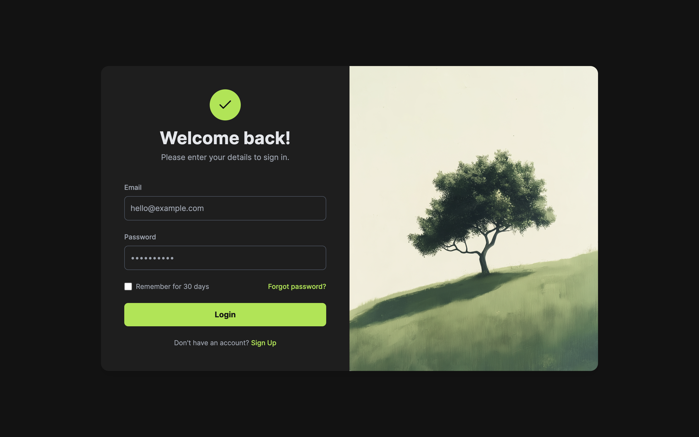

# DailyWorks — Streamline Your Daily Workflow!

DailyWorks is a modern, full-stack task management application designed to help users streamline their daily workflow. This project was built as a developer assignment and showcases a complete range of skills from backend API design to a polished, responsive React frontend.

---

### ✨ Live Demo

- **Visit Application Live:** [https://dailyworks-vl43.onrender.com/](https://dailyworks-vl43.onrender.com/)

---

### 🚀 Features

- **Secure User Authentication:** JWT-based login and registration.
- **Full CRUD for Tasks:** Create, Read, Update, and Delete tasks.
- **Interactive Dashboard:** Includes a productivity stats panel and a fully interactive calendar.
- **Live Time Tracker:** Start and stop a timer to log work sessions.
- **Responsive Design:** A polished, dark-themed UI that works on all devices.
- **Protected Routes:** Secure client-side routing to protect user data.

---

### 🛠️ Technology Stack

- **Frontend:** React (Vite), Tailwind CSS
- **Backend:** Node.js, Express.js
- **Database:** MongoDB (with Mongoose)
- **Authentication:** JSON Web Tokens (JWT)
- **Deployment:** Vercel (Frontend), Render (Backend)

---

### 📸 Screenshots




---

### Locally Project SetUp:—

To run this project locally:

1.  Clone the repository:

    ```bash
    git clone your-repo-url
    cd dailyworks
    ```

2.  **Backend Setup:**
    ```bash
    cd server
    npm install
    # Create a .env file with MONGO_URL and JWT_SECRET
    npm start
    ```
3.  **Frontend Setup:**
    ```bash
    cd client
    npm install
    npm run dev
    ```

---

### 📝 License

This project is licensed under the MIT License. See the [LICENSE](./LICENSE) file for details.

### 📫 Contact

For any questions or contributions, feel free to reach out:

- **Email:** [work.rajeevkumar@gmail.com ](mailto:work.rajeevkumar@gmail.com)
- **GitHub:** [Rajeev Kumar](https://github.com/beRajeevKumar)
- **LinkedIn:** [Rajeev Kumar](https://www.linkedin.com/in/berajeevkumar/)
- **Twitter:** [@be_rajeevkumar](https://twitter.com/be_rajeevkumar)
